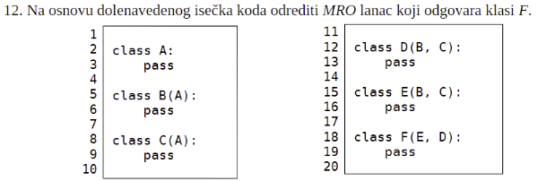
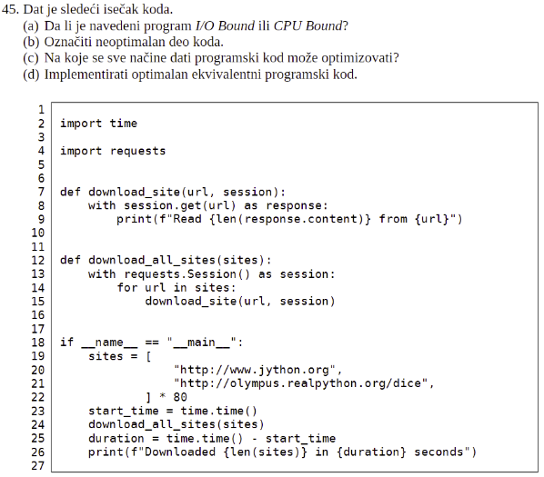
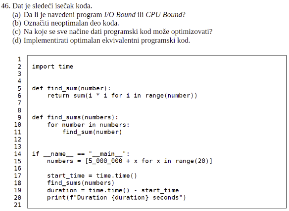

##### U čemu je razlika između kolekcije OrderDict i dict?
- OrderedDict čuva redosled ključeva prilikom dodavanja, dok dict to ne radi. Neke implementacije pythona (npr. CPython) čuvaju redosled ključeva i u običnoj dict klasi, ali ne treba da se oslanjamo na to jer nije deo standarda.

##### Šta default dict prima kao parametar prilikom instanciranja?
- Prima tip vrijednosti koje ce prikazati kada pristupimo nepostojecem kljucu (za int ce prikazati 0, za str ce prikazati “”)
- Takodje mozemo definisati funckiju koja ce vratiti default-nu vrijednost

##### Koja kolekcija dosta podseća na C-ovsku strukturu? Navesti primer njene upotrebe.
- namedtuple
```python 
Point = namedtuple(“Point”, (‘x’, ‘y’))
```

##### Funkcija most_common_words prima 2 parametra: text – tekst (string) u kome prebrojava reči n – prirodan broj.
##### Ova funkcija treba da u jednom iskazu odredi n reči koje se najčešće javljaju u tekstu. Funkcija treba da vrati listu reči, ali ne i koliko puta se svaka od njih pojavljuje.
#### Napomena: Iskazi u kojima se import-uju bublioteke koje dolaze sa standardnom Python implementacijom se ne računaju.
```python
from collections import Counter
most_common_words = lambda text, n: [d[0] for d in Counter(text).most_common(n)]
```

##### Šta je Big O notacija?
- Matematički zapis o asimptotskom ponašanju funkcije u najgorem slučaju u zavisnosti od ulaznih parametara, najčešće veličine ulaza. 

##### Koja je vremenska kompleksnost dodavanja elementa na početak liste, a kolika na početak kolekcije deque? Obratiti pažnju na funkciju deque_primer.
- Lista - O(n), Deque - O(1)

##### Šta je Diamond problem u kontekstu višestrukog nasleđivanja?
- Kada imamo klasu u A koja nasledjuje klase B i C koje obe nasledjuju klasu D i onda se postavlja pitanje koju implementaciju neke metode iz D da koristimo ukoliko je ona overridovana i u B i u C

##### Kako se Diamond problem rešava u Python programskom jeziku?
- Imamo MRO pravila po kojima se dijaman jasno pretvara u linearan lanac nasledjivanja. (ide se sloj po sloj ka gore sa leva na desno)

##### Navesti dva pravila MRO-a?
- Podklase se pretrazuju pre nadklasa
- Pretrazuju se u redosledu navodjenja

##### Šta predstavlja super u programskom jeziku Python?
- Predstavlja prvu sledecu nadklasu u MRO lancu (klasu koja je naslijedjena)
- Mozemo koristiti da zovemo metode nadklase

##### Da li programski jezik Java nativno podržava višestruko nasleđivanje? Kako se ono realizuje?
- Ne podrzava na nacin na koji podrzava python
- Mozemo ga realizovati koriscenjem vise interfejsa

##### MRO Lanac primer

- E, D, B, C, A, object

##### Da li su klase objekti u programskom jeziku Python?
- Da

##### Ko je zadužen za kreiranje klasa?
- Metaklasa (klasa je instanca metaklase)

##### Za šta se sve koristi type u Python programskom jeziku? Navesti primere.
- Koristi se za odredjivanje tipa promjenljive (type(obj))
- Da dinamicki napravimo klasu.
```python
B = type(‘B’, (<nadklase>), {<atributi_klase>})
```

##### Za šta je class lepša sintaksa (engl. syntactic sugar)? Navesti primer.
- One su objekti

##### Šta su callback funkcije?
- Callback funkcije u Pythonu su funkcije koje se prosleđuju kao argumenti drugim funkcijama. Ove funkcije se kasnije pozivaju unutar te funkcije kao povratni poziv (callback) kako bi izvršile određenu operaciju ili manipulaciju nad podacima.

##### Koja je razlika između preemptive i non-preemptive multitasking-a?
- U preemptive schedulingu proces moze biti prekinut kako bi se izvrsavao neki s vecim prioritetom dok u non-preemptive novi procesi cekaju da se postojeci zavrsi (a moze sam da se prekida)

##### Šta su korutine (u programskom jeziku Python)?
- Non-preemptive niti. Slicne generatorima ali sa par dodatnih funkcija. Koriste se u non-preemptive programiranju i mogu da se suspenduju i nastavljaju od strane programera.

##### Šta je “pumpa događaja” (engl. event loop)?
- To je konstrukt koji omogucava procesima da se blokiraju i da u to vreme da drugima da se izvrsavaju. Takodje omogucava “prenos” poruka. Neki event ce zatraziti poruku i blokirati se dok ona ne stigne te ce ga event loop probuditi da nastavi izvrsavanje sa tom pristiglom porukom.

##### Šta je asinhrono programiranje?
- Izvrsavanje koda u pozadini. Instrukcija ne blokira program vec se ide dalje, ali onda rezultat te instrukcije ne možemo dobiti odmah već se koristi promise ili registruje callback.

##### Šta je konkurentno programiranje?
- Programiranje koje koristi vise niti gdje jedna nit se izvrsava u procesoru privremeno, onda joj druga zauzme mjesto sve dok se sav kod ne izvrsi. Za razlikom od asinhronog, nemamo nužno callbacke. Više imamo mutexe semafore itd.

##### Šta je paralelno programiranje?
- Izvrsavanje niti na vise procesora
- Niti se izvrsavaju istovremeno

##### Koja je razlika između konkurentnog i paralelnog programiranja?
- U konkurentnom svaka nit ceka svoje vrijeme izvrsavanja na jednom procesoru, dok se u paralelnom programiranju koristi vise procesora i te niti se mogu dodijeliti tim procesorima pri cemu se niti mogu izvrsavati istovremeno

##### Šta je proces?
- Osnovna jedinica izvrsavanja programskog koda unutar operativnog sistema

##### Šta je nit?
- Osnovna jedinica izvrsavanja unutar procesa

##### Koja je razlika između procesa i niti?
- Proces je program u izvršavanju, a nit je tok instrukcija u okviru procesa. Jedan proces može imati više niti. Niti su “manje” od procesa. Razlikuje se i način komunikacije.

##### Kako komuniciraju niti, a kako procesi?
- Niti komuniciraju preko deljenih resursa koje deklariše zajednički proces, a procesi komuniciraju preko fajlova, http komunikacije itd. (kod nekih starijih OS su mogli pristupiti deljenoj memoriji).

##### Koja je razlika između generatora i korutine?
- Generatori koriste yield da bi izbacili vrednost dok korutine mogu da koriste yield i da prihvate vrednost (spolja putem send) .
- Svaka korutina je generator, obrnuto ne vazi.

##### Da li se generatori u programskom jeziku Python mogu ulančavati? Ukoliko mogu, navesti primer, u suprotnom navesti razlog zašto ne.
- Mogu, koristeći yield from
### !!! FALI PRIMER !!!

##### Šta je profajler (engl. profiler)?
- Program koji prikuplja podatke o izvršavanju programa tokom njegovog rada. Najčešći podaci koji se prikupljaju su vreme izvršavanja (pojedinih funkcija itd.), utrošak memorije, učestalost poziva određenih instrukcija/funkcija itd.

##### Šta je GIL u programskom jeziku Python?
- GIL (global interpreter lock) je zaključavanje koje ograničava izvršavanje Python koda samo jednoj niti u isto vreme, bez obzira na to koliko niti ili procesora ima vaš računar. Ovaj mehanizam postoji radi očuvanja doslednosti podataka i zaštite deljenih resursa od trka i nesinhronizovanog pristupa.

##### Koliko niti može istovremeno da izvršava kod u jednom Python procesu? Zašto?
- Jednu, zbog GIL-a

##### Šta je race condition? Navesti primer.
- Pojava da rezultat izvršavanja programa Adidas deterministički, već zavisi od redosleda izvršavanja 2 niti. Loša stvar.
- Jedna nit ce pristupiti podatku i izmijeniti ga, medjutim moze se desiti da u sred ovog procesa druga nit pokusa da pristupi podatku i time poremeti podatak
- Primjer: Nit A uzima resurs C i uvecava ga za jedan i vraca. To zahtjeva prvo uzimanje resursa C, dobavljanje vrijednosti, povecavanje za jedan i cuvanje podatka. Medjutim nit B uzima resurs prije nego sto je nit A povecala vrijednost za jedan i ona ga povecava za 2. U zavisnosti koja nit zadnja sacuva vrijednost, jedna od ovih akcija ce se izgubiti

##### Šta je trka do podataka (engl. data race)? Navesti primer.
- Više zadataka/procesa pristupa dijeljenom resursu, što može dovesti do neželjenog ponašanja (nlp. deadlock). Npr. dva procesa vrše upis u isti fajl… 

##### Šta je štetno preplitanje? Navesti primer.
- Kada dve niti recimo, menjaju isti podatak bez dobre kontrole pa imamo slucaj da jedna krene da menja a potom i druga i na kraju nemamo ispravan podatak.. Npr ako imamo broj 2 i treba da dodajemo na njega iz dve niti, moze se desiti da prva bude prekinuta u momentu kada uzme 2 kako bi povecala na 3 i da u tom momentu druga dodje i prebaci na 3 ali cim 1. Nastavi opet ce biti vraceno na 3 umesto dalje na 4.. 

##### Šta je deadlock? Navesti primer.
- Deadlock je kada niti medjusobno cekaju da druga otpusti resurse kako bi mogla nastaviti sa radom
- Imamo resurse C i D i niti A i B. Da bi se uspjesno izvrsile niti A i B, trebaju im oba resursa C i D. A uzima resurs C, a B uzima resurs D. Sada nit A ceka da nit B otpusti resurs D kako bi mogao da nastavi sa izvrsavanjem, a nit B ceka da nit A otpusti resurs C kako bi ona mogla nastaviti sa izvrsavanjem. Desio se deadlock

##### Da li se kod asinhronog programiranja javlja problem štetnog preplitanja? Zašto?
- Ne, zato sto se izvrsava samo jedna nit u jedno vrijeme??

##### U čemu je razlika između I/O Bound i CPU Bound programa?
- I/O bound program je onaj kod kojeg je bottleneck u komunikaciji I/O operacija npr. rad sa fajlovima. U CPU bound programima je čekanje izazvano dugačkim sinhronim operacijama.

##### Na koje je sve načine moguće optimizovati I/O Bound programe u programskom jeziku Python? Koji je od njih najbolji i zašto?
- Da odlozimo await sto vise (Da sto manje cekamo)
- Async taskovi, ali moze i sa threadingom i sa multiprocessingom

##### Na koje sve načine je moguće optimizovati CPU Bound programe u programskom jeziku Python? Koji je od njih najbolji i zašto?
- Tu samo multiprocessing ima smisla (paralelno izvrsavanje)

##### Šta će se desiti ukoliko se prilikom asinhronog programiranja koriste zadaci koji nisu kooperativni (ne komuniciraju sa event loop-om)?
- Guše event loop. Morace se cekati da oni zavrse kako bi event loop nastavio dalje rasporedjivanje

##### Šta je jako, a šta slabo skaliranje?
- Oba su horizontalna skaliranja
- Jako - isti problem al zelim da resim brze tako sto dodajem processor (npr. Matrica 1000x1000) velicina problema po proc se smanjuje
- Slabo - problem raste a zelim iste performanse dodajemo jezgra ( Web aplikacija gde problem ima promenljivu velicinu) velicina problema po proc je ista

##### Prilikom paralelizacije CPU Bound programa multiprocessing bibliotekom, na koji način se bira broj procesa? Šta sve treba uzeti u obzir prilikom razmatranja?
- Bira se shodno tome koliko jezgara imamo na računaru. Bitna je i veličina problema. Ako je problem mali, ne isplati se deliti više jezgara jer i to ima overhead. Eksperimentalno utvrdimo najbolji broj procesa.


- a) IO Bound
- b) Linija 14.
- c) Svaki download site treba asinhrono pa se pravi asinhrona kolekcija. Ne postoji async for loop u pajtonu.
- d) ..
- 

- a) CPU bound
- b) Linije 10,11.
- c) Paralelizovati find sum za svaki number u numbers. Možda i lenjom evaluacijom liste numbers, koristeći generator a ne list komprihenšn.
- d) ..
