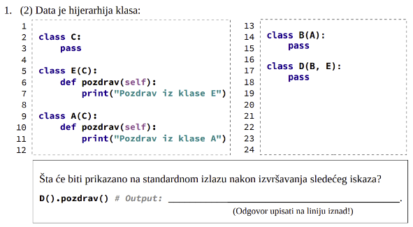
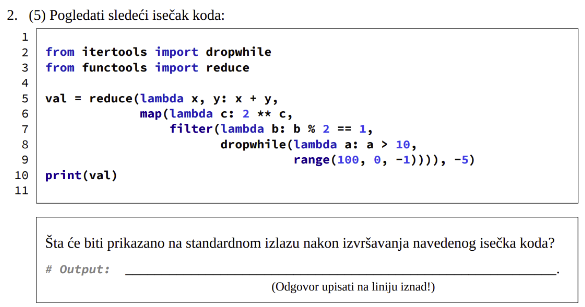
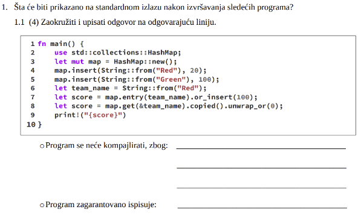
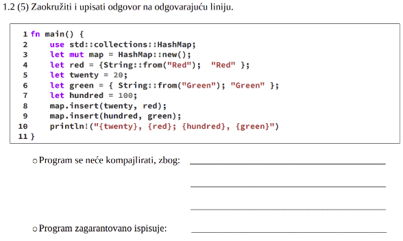
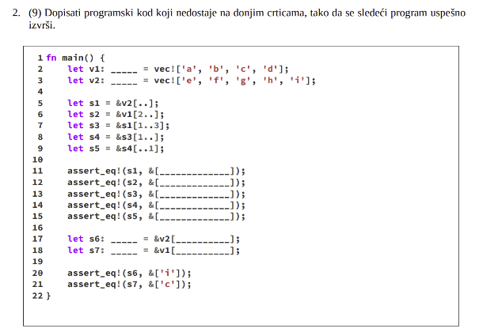

# RESENJE PRIMERA TESTA

## Part 1

##### (7) Dopuniti sledeće rečenice. (Odgovore upisati na odgovarajuće linije): 
- U programskom jeziku (Python), magične metode često služe za implementaciju (protokola). Jedan od njih je iterator.
- Programski jezik Rust ima komponentu pod nazivom (borrow checker) koja proverava da li su sve pozajmice validne. 
- U kontekstu Rust programskog jezika, dve vrste putanja unutar stabla modula su: (apsolutne, relativne)

##### ([-13, 13]) Da li su navedene tvrdnje tačne (zaokružiti)?
- Python podržava first-class funkcije. •Da •Ne •Ne znam
    - DA

- U programskom jeziku Python, dekoratori predstavljaju funkcije prvog reda. •Da •Ne •Ne znam
    - NE (dekorati su funkcije viseg reda jer one sadrze drudge funkcije)

- Konkurentno programiranje je podskup paralelnog programiranja. •Da •Ne •Ne znam 
    - NE

- U kontekstu programskog jezika Rust, upotreba generičkog koda u većini slučajeva ne dovodi do degradacije performansi. •Da •Ne •Ne znam 
    - NE
    - Dyn nije genericki kod 
    - Pazljivo citaj (ne u vecini slucajeva nego NIKADA ne dovodi do degradacije pa je odgovor ne)

- U programskom jeziku Rust, metoda ne može uzeti vlasništvo nad self. •Da •Ne •Ne znam 
    - NE
    - Moze uzeti, znaci NE.

- U kontekstu programskog jezika Rust, navođenje tipa promenljive nije uvek obavezno. •Da •Ne •Ne znam
    - DA

- U kontekstu programskog jezika Rust, možemo istovremeno imati promenljivu i nepromenljivu referencu na element vektora. •Da •Ne •Ne znam 
    - NE

- U programskom jeziku Rust, životni vek varijable ne mora da sadrži životni vek reference pozamljene od te varijable. •Da •Ne •Ne znam 
    - NE
    - Let s1 = …
    - { let s2 = &s1; }
    - println(s2)

- U kontekstu programskog jezika Rust, osobine ne mogu da implementiraju metodu. •Da •Ne •Ne znam 
    - NE

## Part 2

- Pozdrav iz klase A

- Dropwhile odbacuje iteraciju dok nije ispunjen uslov
- Samo neparni brojevi zbog filtera
- Nema digitrona, moze i ovo samo sa lijeve strane
- 2^9  + 2^7 + 2^5 + 2^3 + 2^1 - 5 = 677

## Part 3

- map.entry() - ako postoji vratice element ako ne postoji upisace novi element (ubacice novi kljuc), uzima ownership nad key, a mi koristimo dalje tu referencu, pa zbog toga nece da se kompajlira

- red i green su string slice
- insert() nad string slice ne radi move, pa je onda ovo validno
- Da su red i green bili String onda bi bila greska jel bi prebacili vlasnistvo
- Ispisuje: 20, Red; 100, Green
- Napomene: dace nam potpis funkcije, necemo morati znati napamet za neke funkcije pa onda ne moramo uciti da li se pozajmljuje ili preuzma vlasnistvo.

- Vec<char>
- Vec<char>
- &[‘e’, ‘f’, ‘g’, ‘h’, ‘i’ ]
- &[‘c’, ‘d’ ] 
- &[‘f’, ‘g’ ]
- &[‘g’ ]
- &[‘g’ ]
- &Vec<char> = &v2[4..]; 
- &Vec<char> = &v1[2..3];
